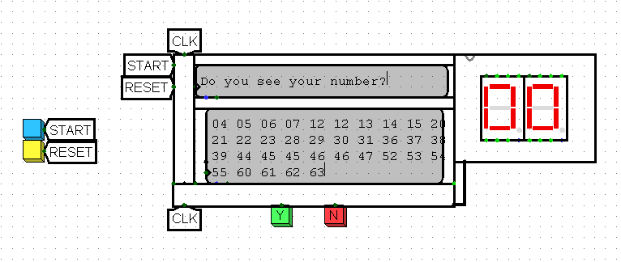

# GuessYourNumber

Questo progetto logisim consiste nell'implementazione di una macchina in grado di indovinare numeri.  

Scegli un numero da 1 a 63, dopo di chè rispondi alle 6 domande che ti vengono poste e infine la macchina ti mostrerà a schermo il numero che hai pensato.
Le "domande" sono fondamentalmente 6 tabelle che contengono un insieme di numeri: se vedi il tuo numero, seleziona 'Y', altrimenti 'N'. Dopo aver risposto a tutte le domande, la tua scelta verrà visualizzara su un doppio 7 Segment Display!

## Come funziona

Il concetto principale che sta dietro all'indovinare il numero è quello che segue:

ci sono 6 tabelle, ognuna di esse contiene uno specifico set di numeri che in forma binaria contengono un '1' in una certa posizione; per esempio la prima tabella conterrà solo numeri che hanno un '1' alla posizione 0 (1 [00000**1**], 3 [00001**1**], 5 [00010**1**] ...), la seconda conterrà numeri che hanno un '1' alla posizione 1 e così via. Se il giocatore risponde in modo positivo, la macchina setta il bit alla posizione *n* ad '1', altrimenti a '0', in questo modo "costruisce" il numero scelto.

### Componenti

- **DisplayWrapper**: questo componente di wrapping viene utilizzato per avvolgere i due TTY, il componente *TTYLogic* e la ROM in cui sono salvate le frasi, le domande e le tabelle;
- **TTYLogic**: come suggrisce il nome, questa è la logica che gestisce le TTY, quindi emette l'indirizzo per la ROM, segnala quando l'intestazione TTY, o la principale, dovrebbero visualizzare o resettare il proprio contenuto;
- **7SegDriver**: questo circuito è utilizzato per gestire i 7 Segment Driver;
- **BinToBCD**: convertitore da Binary a Binary-Coded Decimal; siccome necessito di due 7 Segment Display per visualizzare un numero decimale a 2 cifre, devo convertire il numero a 6-bit in uno a 2 cifre da 4-bit (ex. 12 [001100] -> 0001 [1], 0010 [2]);
- **Display**: un altro componente di wrapping, questo combina il *BinToBCD* e i due *7SegDrivers* per mostrare il numero finale sul doppio 7 Segment Display;
- **Thinker**: questo è il componente che fa la magia! Quando viene premuto 'Y' o 'N', setta il bit corretto e lo sposta verso destra durante tutto il processo, così da comporre il numero.

## Configurazione

Per il corretto utilizzo del gioco, è necessario impostare la Frequenza di Tick (Clock) a 128Hz oppure 256Hz e lo zoom al 200%.

## Come giocare

1. Scegli un numero da 1 a 63
2. Fai clic su "Start" per avviare il gioco
3. Rispondi alle domande facendo clic su "Y" o "N"
4. Se vuoi giocare di nuovo, fai clic su "Reset"

## Sample Image

